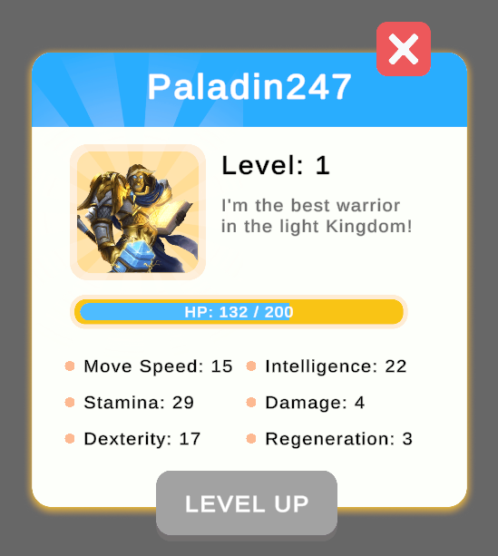
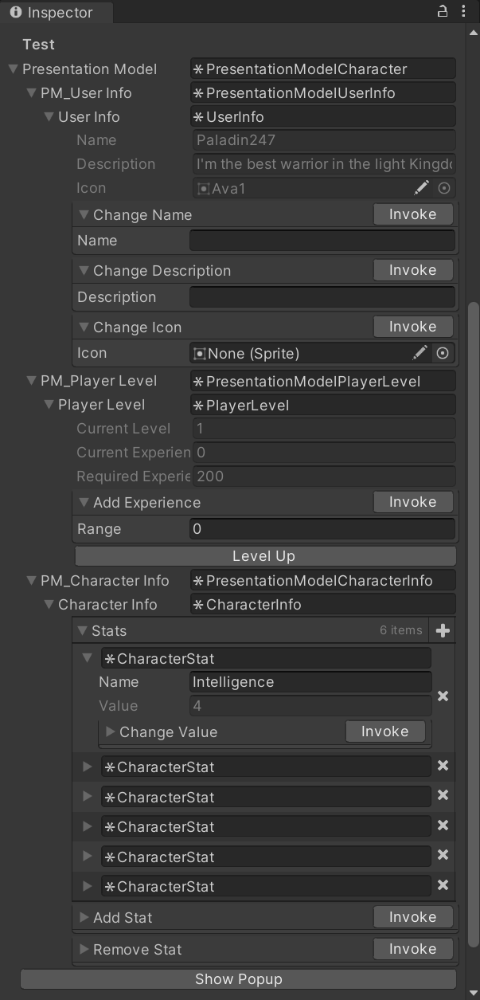

# Presentation Model

### Описание
Демонстрация MV* шаблона проектирования Presentation Model и работы с UI (сверстал попап).

### Инструкция
Чтобы протестировать попап, необходимо выбрать на сцене "PopupManager", нажать в инспекторе кнопку "Show Popup" и раскрыть поле "Presentation Model".

### Особенности
- Presentation Model
- Zenject
- UI

### Плагины
- Odin Inspector

### Скриншоты
\

